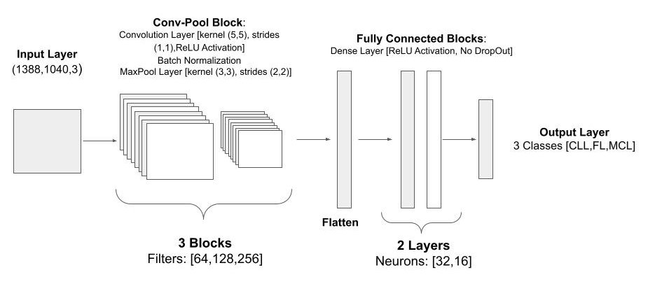
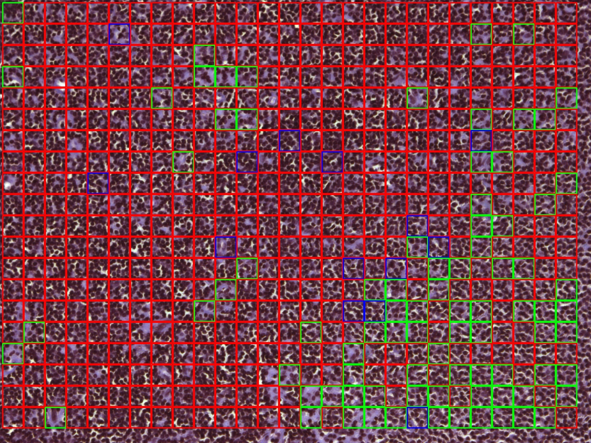

# Lymphoma Subtype Histopathology Classificator (CNN based)

## Authors:
**Matteo Marchesin**  
**Antonio Iacuzio**

## Abstract
Lymphoma is a type of cancer that originates in lymphocytes and encompasses several subtypes, each characterized by distinct prognoses and treatment approaches. These subtypes can traditionally be distinguished based on their specific morphological patterns and cytological features, although modern classification increasingly relies on molecular and immunological techniques.
This project implements a **Convolutional Neural Network (CNN)** to classify histological images of these three lymphoma subtypes.  
Images are divided into small patches that are independently classified, and the image-level label is assigned using a **winner-take-all** strategy (majority voting on patch results).  

**Model performance:**
- MCL: Accuracy = 0.90, Recall = 0.93  
- FL: Accuracy = 0.92, Recall = 0.92  
- CLL: Accuracy = 0.91, Recall = 0.89  

---

##  Method
### Dataset Description
The dataset used in this study comprises [hematoxylin and eosin (H&E)](https://en.wikipedia.org/wiki/H%26E_stain) stained histopathological images categorized by lymphoma subtype.  
It includes a total of **374 RGB images** (size: **1388 × 1040 pixels**), distributed as follows:

| Lymphoma Subtype | Acronym | Number of Images |
|------------------|----------|------------------|
| Chronic Lymphocytic Leukemia | CLL | 133 |
| Follicular Lymphoma | FL | 139 |
| Mantle Cell Lymphoma | MCL | 122 |
| **Total** | — | **374** |

On Kaggle you can find the data-set to [download](https://www.kaggle.com/datasets/andrewmvd/malignant-lymphoma-classification?select=MCL).

The dataset was split into train (85%) and test (15%); the training set was further divided into training (80%) and validation (20%) subsets for hyperparameter tuning.

### 2. Image Preprocessing

The dataset showed substantial color variability and occasional artifacts due to differences in sample preparation, staining, and image acquisition protocols.

To minimize staining and acquisition variability:

- **Standardization** of color distributions using *Principal Components Color Matching (PCCM)* (`colortrans` library).  
- **Color Deconvolution** to isolate hematoxylin and eosin components (`HistomicsTK`).  

These transformations were evaluated but found not to improve classification accuracy for this dataset.

### 3. CNN Architecture

  
   
  <em>CNN Architecture</em>

We started from a baseline model similar to that proposed by Janowczyk et al., adapting it to larger input patches (50×50 vs 32×32) and convolutional layers with more filters, while keeping kernel size and stride unchanged.

A simplified **AlexNet** architecture was implemented in **Keras**, adapted for small input patches (50×50×3).  

**Layers:**
- Convolution + Batch Normalization + MaxPooling blocks  
- Flatten layer  
- Dense layers (ReLU activation)  
- Output layer (3 neurons, softmax via SparseCategoricalCrossEntropy loss)

### Training Configuration
- **Patch Size:** 50×50 (best trade-off between context and efficiency)  
- **Batch Size:** 250 (improved validation stability)  
- **Dropout:** 0.2 (regularization)  
- **Learning Rate:** 1e−3 (with optional decay)  
- **Epochs:** 200  
- **Optimizer:** Adam
---

## Results

  
   
  <em>Example of an output image with classified patches.[ blue (MCL), green(FL), red(MCL) ]</em>

The CNN achieved per-class accuracy between 0.90–0.93, comparable with or exceeding previous patch-based CNN approaches on similar datasets.

Model performance was consistent across classes, confirming good generalization.

Despite these strong results, diagnostic applications in pathology demand 100% reliability; therefore, the model should be viewed as a decision support tool, not a diagnostic replacement.

**Future improvements could include:**

-Adding a “non-pathological” class for better real-world coverage;

-Combining morphological and molecular data for multimodal classification;

-Refining color standardization and stain deconvolution pipelines.

## Project Files Description

###  main_file.ipynb
The `main_file.ipynb` notebook includes all **data preprocessing steps**, the **CNN model definition**, and the **training process**.  
It can be executed step-by-step to reproduce the model training workflow and visualize performance metrics such as accuracy and loss.

### live_classificator.py
The `live_classificator.py` script allows users to **run the trained classifier on sample images**.  
It applies a **winner-take-all** decision strategy to assign each input image to the most likely lymphoma subtype.
